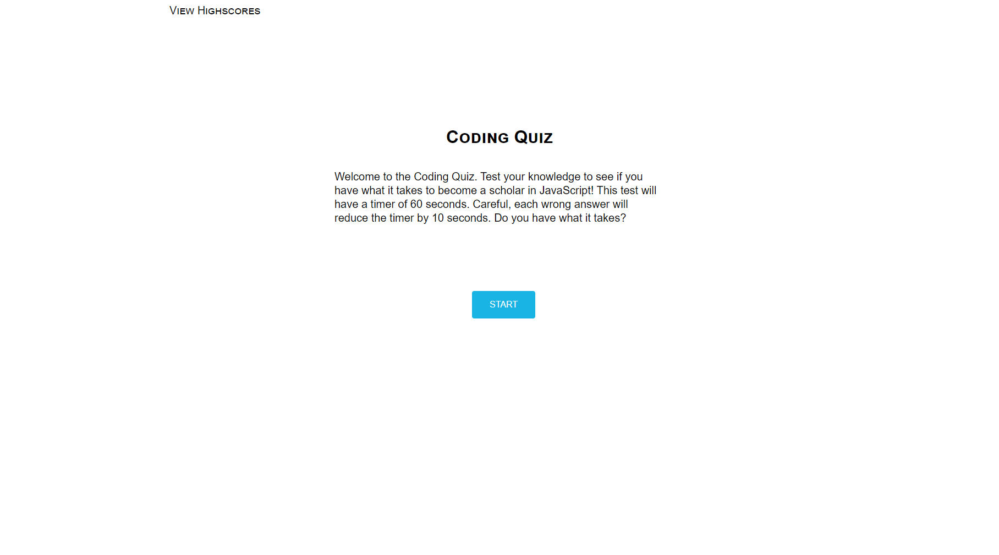

## Name

Coding Quiz

## Description

This quiz will test your knowledge of Javascript. With 60 seconds on the timer, think fast to click the right answer! Upon finishing the quiz you can save your high score. Can you beat your record?

## Badges

## Visuals

## Usage

Click the start button to start quiz. You will be prompt to a new page with quiz questions and a timer set of 60 seconds. When clicking on an answer you will get a visual of red and green button to know the result of the answer you have chosen. Once quiz is completed you will be prompt to a page where you can save your high score! To view your initial and high score click on the 'view highscore' button at the top of the page.

## Support

If you come across a bug or just have any feedback, support can be contacted at DJonHarrison94@gmail.com!

## License

MIT License

Copyright (c) 2022 DJonJasmine

Permission is hereby granted, free of charge, to any person obtaining a copy
of this software and associated documentation files (the "Software"), to deal
in the Software without restriction, including without limitation the rights
to use, copy, modify, merge, publish, distribute, sublicense, and/or sell
copies of the Software, and to permit persons to whom the Software is
furnished to do so, subject to the following conditions:

The above copyright notice and this permission notice shall be included in all
copies or substantial portions of the Software.

THE SOFTWARE IS PROVIDED "AS IS", WITHOUT WARRANTY OF ANY KIND, EXPRESS OR
IMPLIED, INCLUDING BUT NOT LIMITED TO THE WARRANTIES OF MERCHANTABILITY,
FITNESS FOR A PARTICULAR PURPOSE AND NONINFRINGEMENT. IN NO EVENT SHALL THE
AUTHORS OR COPYRIGHT HOLDERS BE LIABLE FOR ANY CLAIM, DAMAGES OR OTHER
LIABILITY, WHETHER IN AN ACTION OF CONTRACT, TORT OR OTHERWISE, ARISING FROM,
OUT OF OR IN CONNECTION WITH THE SOFTWARE OR THE USE OR OTHER DEALINGS IN THE
SOFTWARE.